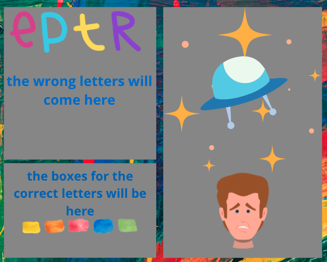

# SPACEMAN

Spaceman is a version of the well-known game (hang man). in this game player one will enter a word which will be kept hidden (in boxes, a box for each letter) and then pass it to player two. Player Two will try to guess that word by entering letters, if the letter occurs in the word it'll be revealed in all of its correct positions, if not a part of the spaceship will appear. if player two guessed all the correct letters before the alien appears, the game is over and player two wins. if player two wasn't able to guess all the correct letters, the spaceship will be built and the alien will kill the spaceman, the game is over and player one wins.

## Simple wire fram for the game

## technology used
This game is built using basic HTML, Javascript was used to dynamically interact with the HTML in manipulating DOM elements, building functions and using event listeners. CSS was used to layout the DOM elements on the page and styling them. 

## Future Modification

* in the future, working on adding some more animations and sound effects will be a good thing to do which will give the player more engaged experience and more fun.
* adding players scores and timers will add some challenging motivation to the game.

## play the game
- [play the game](https://anfalfadhil.github.io/Project1%20/the-project/index.html)
-------
## Enjoy :)
